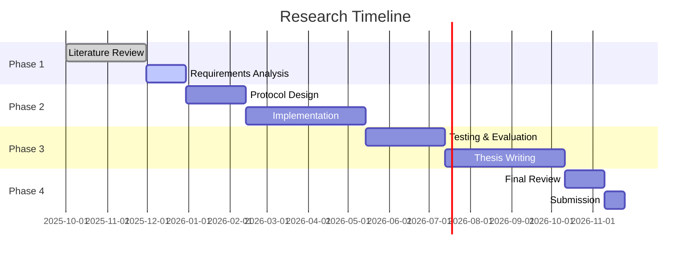

# Tangram Protocol - Decentralized Framework for Secure Medical Data Analysis: End-to-End Zero-Knowledge Proofs with Distributed Data Storage Systems

**To:**
Professor James Kang,
Professor Tri Dang,
Professor Nalin Arachchilage,

**From:**
Tristan Nguyen
PhD Candidate
tristansummer23@gmail.com

## Abstract
A research proposal for a decentralized, secure, and patient-centric medical record protocol leveraging blockchain technology and zero-knowledge proofs to revolutionize healthcare data management.

## Table of Contents
- [Introduction](#introduction)
- [Research Objectives](#research-objectives)
- [Literature Review](#literature-review)
- [Methodology](#methodology)
- [Expected Contributions](#expected-contributions)
- [Research Timeline](#research-timeline)
- [References](#references)

## Introduction and Problem Statement

This study will undertake a comprehensive systematic review of existing medical data sharing methodologies, with particular emphasis on multi-institutional clinical trial data management practices. The review will critically examine current frameworks, technologies, and policies governing medical data access and analysis to uncover inherent limitations in privacy preservation, interoperability challenges, and computational inefficiencies. Through this analytical process, the study aims to identify unresolved issues and research gaps within the literature regarding secure collaborative analysis of longitudinal patient health records, thereby establishing a clear rationale and justification for developing the Tangram Protocol as a novel solution.

Current medical data systems suffer from fundamental architectural flaws that impede secure collaboration. This research will systematically analyze how traditional Electronic Health Records (EHRs) create isolated data silos vulnerable to cyberattacks, while existing decentralized approaches fail to provide true end-to-end privacy guarantees during analysis phases. The investigation will reveal how medical data typically remains protected only in transit and at rest, but must be decrypted for analysis, creating critical vulnerability points that compromise patient privacy.

This study will develop and validate the Tangram Protocol as a transformative solution that leverages Zero-Knowledge Proofs (ZKP) for both access control and private computation on medical data stored in decentralized storage systems. The research will demonstrate how this approach enables collaborative clinical trial analysis while maintaining complete data confidentiality throughout the entire lifecycle, addressing the fundamental gap where medical data privacy is compromised during computational analysis phases.

## Research Objectives
1. Design a decentralized protocol for secure medical record management
2. Implement zero-knowledge proofs for privacy-preserving data sharing
3. Ensure interoperability with existing healthcare standards (HL7, FHIR)
4. Develop a patient-centric access control mechanism
5. Evaluate performance and security of the proposed solution

## Literature Review
### Blockchain in Healthcare
- Current blockchain-based medical record systems
- Smart contracts for healthcare data management
- Privacy-preserving techniques in healthcare

### Related Work
- MedRec
- FHIR Chain
- Other decentralized healthcare solutions
- Regulatory compliance (HIPAA, GDPR)

## Methodology
### System Architecture
- Network topology
- Data storage model
- Consensus mechanism
- Smart contract design

### Technical Components
1. **Identity Management**
   - Decentralized identifiers (DIDs)
   - Verifiable credentials

2. **Data Model**
   - Standardized medical data representation
   - On-chain vs. off-chain storage

3. **Privacy Mechanisms**
   - Zero-knowledge proofs
   - Selective disclosure
   - Data minimization techniques

4. **Access Control**
   - Attribute-based access control
   - Patient consent management
   - Emergency access protocols

### Implementation Plan
- Technology stack selection
- Development phases
- Testing and validation

## Expected Contributions
1. Novel protocol for decentralized medical records
2. Enhanced privacy-preserving techniques
3. Improved patient data ownership and control
4. Interoperability framework for healthcare data
5. Performance and security evaluation metrics

## Research Timeline

## References
[1] Nakamoto, S. (2008). Bitcoin: A Peer-to-Peer Electronic Cash System.
[2] Azaria, A., et al. (2016). MedRec: Using Blockchain for Medical Data Access and Permission Management.
[3] Mettler, M. (2016). Blockchain Technology in Healthcare: The Revolution Starts Here.
[4] Zhang, P., et al. (2018). FHIRChain: Applying Blockchain to Securely and Scalably Share Clinical Data.
[5] World Health Organization. (2016). Global diffusion of eHealth: Making universal health coverage achievable.

[6] Tawfik, A.M., Al-Ahwal, A., Eldien, A.S.T. et al. ACHealthChain blockchain framework for access control and privacy preservation in healthcare. Sci Rep 15, 16696 (2025). https://doi.org/10.1038/s41598-025-00757-1
https://rdcu.be/eByWz
[7] A. A. Monie, D. K. P. V. V. V. Rajeswari, and K. S. B. Prasad, "Blockchain technology for securing and managing electronic health records (EHRs)," Int J Med Eng Inform, vol. 15, no. 5, pp. 536–550, 2023, doi: 10.1504/IJMEI.2023.133742.
[8] Hedera, "Healthcare," Hedera, 2024. [Online]. Available: https://hedera.com/healthcare
[9] S. K. H. Islam, M. A. Baig, M. M. Khan, and M. A. Khan, "A Blockchain-Based Framework for Secure and Privacy-Preserving Electronic Health Record Sharing," IEEE Access, vol. 11, pp. 11467–11482, 2023, doi: 10.1109/ACCESS.2023.3241280.
[10] A. Azaria, A. Ekblaw, T. Vieira, and A. Lippman, "MedRec: Using Blockchain for Medical Data Access and Permission Management," in 2016 2nd International Conference on Open and Big Data (OBD), Vienna, Austria, Aug. 2016, pp. 25–30, doi: 10.1109/OBD.2016.11.
[11] Hedera, "Smart Contracts in Healthcare," Hedera, 2024. [Online]. Available: https://hedera.com/learning/smart-contracts/smart-contracts-healthcare
[12] A. Dwivedi, G. Srivastava, S. Dhar, and R. Singh, "A decentralized privacy-preserving healthcare blockchain for IoT," Sensors, vol. 19, no. 2, p. 326, Jan. 2019, doi: 10.3390/s19020326.
[13] S. Goldwasser, S. Micali, and C. Rackoff, "The Knowledge Complexity of Interactive Proof Systems," SIAM Journal on Computing, vol. 18, no. 1, pp. 186–208, Feb. 1989, doi: 10.1137/0218012.
[14] D. Ben-Sasson, I. Bentov, Y. Horesh, and M. Riabzev, "Scalable, transparent, and post-quantum secure computational integrity," IACR Cryptol. ePrint Arch., vol. 2018, p. 46, 2018. [Online]. Available: https://eprint.iacr.org/2018/046
[15] J. Benet, "IPFS - Content Addressed, Versioned, P2P File System," arXiv:1407.3561 [cs], Jul. 2014. [Online]. Available: http://arxiv.org/abs/1407.3561

[16] https://www.sciencedirect.com/science/article/pii/S1084804523000528
[17] https://arxiv.org/pdf/2504.20700.pdf
[18] https://arxiv.org/pdf/2109.14295.pdf
[19] https://bitfury.com/content/downloads/research-decentralized-e-health-architecture.pdf
[20] https://www.nature.com/articles/s41598-025-00757-1
[21] https://arxiv.org/pdf/1901.10645.pdf
[22] https://pmc.ncbi.nlm.nih.gov/articles/PMC11461297/

---
*Last updated: August 31, 2025*
