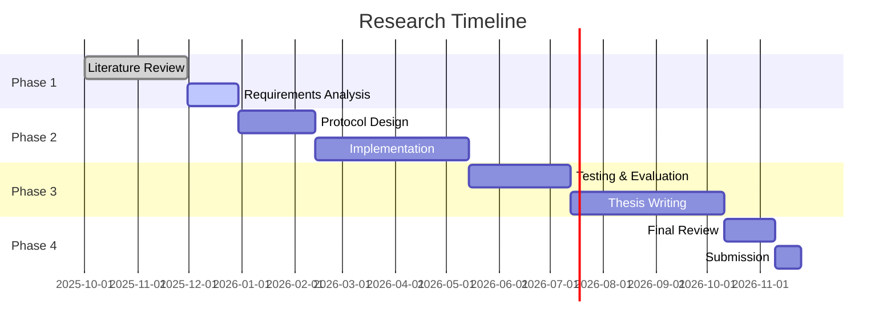

# Tangram Protocol: A Decentralized Framework for Secure Medical Data Analysis

    

**To:**  
- Professor James Kang  
- Professor Tri Dang  
- Professor Nalin Arachchilage

**From:**
Tristan Nguyen, PhD Candidate
(tristansummer23@gmail.com)

## Abstract
This research proposes the Tangram Protocol, a framework designed to address critical gaps in secure medical data analysis. While many decentralized solutions for healthcare exist, this work pioneers a specific, underexplored methodology centered on the tight integration of three key pillars: **hybrid storage-ledger architecture, advanced cryptography (specifically Zero-Knowledge Proofs), and formal verification**. This unique combination creates a secure, privacy-preserving platform where medical data can be analyzed without ever being exposed, addressing a fundamental limitation in existing systems.

Key innovations include a decentralized identity management system, fine-grained access control mechanisms, and privacy-preserving computation capabilities. The protocol's architecture ensures data integrity through cryptographic proofs while maintaining patient confidentiality through advanced ZKP techniques. By eliminating centralized points of failure and enabling verifiable computation on encrypted data, Tangram addresses critical gaps in current healthcare data systems.

This research will validate the protocol's effectiveness through both theoretical analysis and practical implementation, with performance benchmarks against existing solutions. The expected contributions include novel cryptographic constructions for medical data privacy, a reference implementation, and empirical evidence of the system's scalability and security properties. The outcomes aim to establish new standards for ethical and efficient healthcare data utilization in research and clinical practice.

## Table of Contents
- [Tangram Protocol: A Decentralized Framework for Secure Medical Data Analysis](#tangram-protocol-a-decentralized-framework-for-secure-medical-data-analysis)
  - [Abstract](#abstract)
  - [Table of Contents](#table-of-contents)
  - [1. Introduction and Problem Statement](#1-introduction-and-problem-statement)
  - [2. Research Objectives](#2-research-objectives)
  - [3. Literature Review and Theoretical Foundation](#3-literature-review-and-theoretical-foundation)
    - [3.1 Medical Data Sharing and Analysis Challenges](#31-medical-data-sharing-and-analysis-challenges)
    - [3.2 Distributed Ledger Technologies in Medical Data Management](#32-distributed-ledger-technologies-in-medical-data-management)
    - [3.3 Zero-Knowledge Proofs for Medical Data Privacy](#33-zero-knowledge-proofs-for-medical-data-privacy)
    - [3.4 Decentralized Storage for Medical Data](#34-decentralized-storage-for-medical-data)
    - [3.5 Healthcare Interoperability Standards](#35-healthcare-interoperability-standards)
    - [3.6 Global and Regional Regulatory Landscape](#36-global-and-regional-regulatory-landscape)
  - [4. Research Questions](#4-research-questions)
    - [4.1 Framework Architecture and Integration](#41-framework-architecture-and-integration)
    - [4.2 End-to-End Privacy via Zero-Knowledge Proofs](#42-end-to-end-privacy-via-zero-knowledge-proofs)
    - [4.3 Formal Verification and Security Analysis](#43-formal-verification-and-security-analysis)
  - [5. Proposed Methodology](#5-proposed-methodology)
    - [5.1 Phase 1: Theoretical Foundation and Systematic Review](#51-phase-1-theoretical-foundation-and-systematic-review)
    - [5.2 Phase 2: Framework Design and Protocol Specification](#52-phase-2-framework-design-and-protocol-specification)
    - [5.3 Phase 3: Prototype Implementation and Empirical Testing](#53-phase-3-prototype-implementation-and-empirical-testing)
    - [5.4 Phase 4: Formal Analysis and Security Verification](#54-phase-4-formal-analysis-and-security-verification)
    - [5.5 Phase 5: Evaluation, Dissemination, and Thesis Compilation](#55-phase-5-evaluation-dissemination-and-thesis-compilation)
    - [5.6 Potential Challenges and Mitigation Strategies](#56-potential-challenges-and-mitigation-strategies)
    - [5.7 Ethical Considerations](#57-ethical-considerations)
    - [5.8 Alignment with Research Objectives](#58-alignment-with-research-objectives)
  - [6. Expected Contributions](#6-expected-contributions)
    - [6.1 Theoretical Contributions](#61-theoretical-contributions)
    - [6.2 Practical Contributions](#62-practical-contributions)
  - [7. Expected Impact and Significance](#7-expected-impact-and-significance)
    - [7.1 Academic Impact](#71-academic-impact)
    - [7.2 Practical Impact](#72-practical-impact)
    - [7.3 Societal Impact](#73-societal-impact)
  - [8. Conclusion](#8-conclusion)
  - [9. Research Timeline](#9-research-timeline)
  - [10. References](#10-references)

## 1. Introduction and Problem Statement

This study undertakes a comprehensive systematic review of existing medical data sharing methodologies, with particular emphasis on multi-institutional clinical trial data management practices. The review critically examines current frameworks, technologies, and policies governing medical data access and analysis. It uncovers inherent limitations in privacy preservation, interoperability challenges, and computational inefficiencies. Through this analytical process, the study identifies unresolved issues and research gaps in the literature regarding secure collaborative analysis of longitudinal patient health records. This establishes a clear rationale and justification for developing the Tangram Protocol as a novel solution [20][21].

Current medical data systems suffer from fundamental architectural flaws that impede secure collaboration. Traditional Electronic Health Records (EHRs) create isolated data silos vulnerable to cyberattacks. Existing decentralized approaches fail to provide true end-to-end privacy guarantees during analysis phases. Medical data typically remains protected only in transit and at rest, but must be decrypted for analysis. This creates critical vulnerability points that compromise patient privacy.

This study develops and validates the Tangram Protocol as a transformative solution that distinguishes itself through a novel synthesis of technologies. Its core innovation lies in a **hybrid architecture** combining a distributed ledger for immutable audit trails with decentralized storage for scalable data management. This structure is secured through **advanced cryptography**, using Zero-Knowledge Proofs (ZKPs) not only for access control but for private computation on encrypted data. Finally, the protocol's integrity is mathematically guaranteed through **formal verification**. This tripartite approach directly addresses the critical vulnerability where data privacy is compromised during computational analysis—a gap left open by most existing frameworks.

## 2. Research Objectives

1. **Design a Decentralized Protocol:** Architect a novel, platform-agnostic protocol for secure medical record management that integrates a hybrid storage-ledger model.
2. **Implement Privacy-Preserving Computation:** Implement and validate advanced Zero-Knowledge Proof (ZKP) circuits to enable privacy-preserving analysis of medical data.
3. **Achieve Native FHIR Interoperability:** Design the protocol's data models and APIs to be natively compliant with **HL7/FHIR** standards, enabling seamless, out-of-the-box integration with existing Electronic Health Record (EHR) systems and health information exchanges.
4. **Develop Patient-Centric Access Control:** Create a robust, patient-centric access control mechanism using decentralized identity and verifiable credentials.
5. **Evaluate Performance and Security:** Rigorously evaluate the protocol's performance, scalability, and security through formal verification and empirical benchmarking against existing solutions.

## 3. Literature Review and Theoretical Foundation

### 3.1 Medical Data Sharing and Analysis Challenges

This study will conduct a systematic examination of medical data sharing challenges across regulatory, technical, and operational dimensions. The investigation will analyze how privacy, security, and interoperability constraints under frameworks like HIPAA and GDPR create barriers to collaborative medical research [4]. Through comprehensive analysis of existing solutions, including blockchain-based frameworks for clinical data sharing [3], the research will identify critical gaps where current approaches fail to enable secure multi-institutional analysis of medical data without compromising patient privacy, thereby establishing the necessity for novel cryptographic approaches that maintain data confidentiality during computation [6][7][9][16][21].

### 3.2 Distributed Ledger Technologies in Medical Data Management

This research will comprehensively evaluate the application of Distributed Ledger Technologies (DLTs) in medical data management, examining early deployments such as MedRec for medical data access and permission management [10] and Hedera's healthcare applications [8][11], to understand scalability and privacy limitations [1][2]. The study will analyze how modern DLTs with expressive smart contract capabilities can serve as foundations for managing medical data as programmable on-chain entities with embedded access policies. This analysis will demonstrate how DLTs can provide immutable audit trails and access control for medical data while integrating with decentralized storage systems for scalable data management, thereby justifying the selection of DLT-based architecture for the Tangram Protocol.

### 3.3 Zero-Knowledge Proofs for Medical Data Privacy

This investigation will conduct an in-depth analysis of ZKP applications in healthcare, examining how cryptographic techniques like zk-SNARKs and zk-STARKs can enable verifiable computation on encrypted medical data [13]. The study will systematically review existing implementations to identify limitations in current approaches and demonstrate how ZKP circuits can execute complex statistical analyses and cohort selections on medical data without revealing underlying patient information. This analysis will establish how ZKP technology can transform medical data analysis by enabling researchers to obtain proven, correct results without accessing raw patient data, thereby providing the theoretical foundation for implementing privacy-preserving computation in the Tangram Protocol.

### 3.4 Decentralized Storage for Medical Data

This research will evaluate decentralized storage systems, including IPFS for content-addressed file systems [15], for their suitability in managing large-scale medical datasets, examining attributes such as censorship resistance, availability guarantees, and cryptographic integrity proofs. The study will analyze how decentralized storage can serve as a secure, off-chain repository for encrypted longitudinal patient health records while maintaining integration with on-chain access control mechanisms, thereby establishing the technical foundation for hybrid on-chain/off-chain medical data management in the Tangram Protocol.

### 3.5 Healthcare Interoperability Standards

This section will conduct a detailed analysis of foundational healthcare interoperability standards, focusing on **Health Level Seven (HL7)** and its modern successor, **Fast Healthcare Interoperability Resources (FHIR)**. The research will trace the evolution from legacy HL7 versions (V2, V3, CDA) to the modern, API-centric approach of FHIR. The analysis will cover:

- **FHIR's Core Principles:** A review of FHIR's design philosophy, including its focus on discrete, computable data elements known as **Resources** (e.g., `Patient`, `Observation`, `Encounter`), its use of modern web standards like RESTful APIs and JSON/XML, and its extensibility through **Profiles** and **Extensions**.
- **Syntactic and Semantic Interoperability:** An examination of how FHIR provides a common data model and terminology bindings (e.g., to SNOMED CT, LOINC) to ensure that exchanged data is both structurally sound and clinically meaningful.
- **Integration Strategy for Tangram:** This study will investigate how Tangram can natively align with FHIR by modeling on-chain digital assets and off-chain data pointers as FHIR Resources. The protocol will expose a FHIR-compliant API layer, enabling existing EHR systems and healthcare applications to interact with Tangram using familiar, standardized protocols. This approach ensures that Tangram is not another data silo but a seamless extension of the existing digital health ecosystem, justifying its design as a practical and adoptable solution for clinical environments.

### 3.6 Global and Regional Regulatory Landscape

A comprehensive review of the global and regional regulatory landscape will be conducted to establish a robust compliance foundation for the Tangram Protocol. This analysis will focus on:

- **HIPAA (Health Insurance Portability and Accountability Act):** An in-depth examination of the HIPAA Privacy, Security, and Breach Notification Rules. The study will analyze the definitions of Protected Health Information (PHI) and the obligations of Covered Entities and Business Associates. We will investigate how Tangram's architecture—with its immutable audit trails and ZKP-based privacy controls—can help entities meet HIPAA's stringent requirements for access control, auditability, and data integrity.
- **GDPR (General Data Protection Regulation):** A detailed analysis of GDPR's core principles, including lawfulness, fairness, transparency, data minimization, and purpose limitation. The research will focus on the rights of data subjects (e.g., right to access, right to erasure) and the requirements for data protection by design and by default. We will explore how Tangram's patient-centric model and cryptographic guarantees can support GDPR compliance, particularly in cross-border data sharing scenarios.
- **Other Regional Regulations:** The study will also consider other significant data protection frameworks, such as **Vietnam's Decree 13/2023/ND-CP on Personal Data Protection**. This comparative analysis will identify common principles and divergent requirements, informing the design of a flexible, policy-driven compliance module within Tangram that can be adapted to various jurisdictional demands.

## 4. Research Questions

### 4.1 Framework Architecture and Integration

**Research Question:** This study will investigate how a platform-agnostic, DLT-native framework integrated with decentralized storage can be architected to enable scalable and secure management of medical data for multi-institution clinical trials while maintaining complete privacy throughout the analysis lifecycle.

**Objectives:**

1.1: This research will design and validate the Tangram Protocol as a generalized DLT architecture that models medical data as **FHIR-compliant** on-chain digital assets with embedded ZKP-based access control policies, thereby creating a reusable and interoperable framework applicable across multiple blockchain platforms.

1.2: The study will develop and test a generic interface for integrating decentralized storage protocols with on-chain verification of data availability proofs, thereby enabling scalable medical data management without compromising security or auditability.

1.3: This investigation will conduct comprehensive evaluation of architectural trade-offs between on-chain provenance tracking and off-chain medical data storage to optimize for scalability, security, and regulatory compliance, thereby providing empirical evidence for optimal system design decisions.

### 4.2 End-to-End Privacy via Zero-Knowledge Proofs

**Research Question:** This research will determine how ZKP can enable an end-to-end privacy-preserving architecture for medical data that secures both granular access control and allows for verifiable, private computation on sensitive longitudinal patient health records without ever exposing the underlying data.

**Objectives:**

2.1: This study will implement and validate ZKP-based smart contracts that facilitate verifiable credential checks for medical data access while preserving researcher anonymity and institutional privacy, thereby demonstrating practical privacy-preserving access control for sensitive medical data.

2.2: The research will design, implement, and benchmark ZKP circuits for representative clinical trial queries including patient cohort selection and aggregate statistical functions that execute over encrypted medical data stored in decentralized storage, thereby proving the feasibility of complex medical data analysis without compromising patient privacy.

2.3: This investigation will design and validate a modular regulatory compliance framework that maps Tangram's privacy-by-design architecture to the specific requirements of international data protection laws, including **HIPAA**, **GDPR**, and **Vietnam's Decree 13/2023/ND-CP**, ensuring the protocol can be deployed globally.

### 4.3 Formal Verification and Security Analysis

**Research Question:** This study will establish what formal verification methodologies can provide rigorous mathematical guarantees for the cryptographic and smart contract components managing medical data in the Tangram Protocol, and empirically demonstrate how its performance compares with existing medical data sharing frameworks.

**Objectives:**

3.1: This research will employ formal verification tools to mathematically prove the correctness and security of Tangram's smart contract logic and ZKP validation mechanisms for medical data access control, thereby providing mathematical assurance of system security properties.

3.2: The study will develop and validate a comprehensive formal threat model encompassing adversarial behaviors in medical data systems and formally prove Tangram's resilience against collusion, inference attacks, and ZKP setup vulnerabilities, thereby establishing robust security guarantees for sensitive medical data handling.

3.3: This investigation will conduct extensive benchmarking of Tangram's performance against established frameworks like **MedRec** and **FHIRChain**. Using HL7/FHIR-compliant synthetic medical datasets generated by **Synthea™**, we will measure transaction latency, storage proof verification times, and ZKP generation/verification overhead for private medical data computations [14], thereby providing empirical evidence of practical viability.

## 5. Proposed Methodology

This research adopts a multi-phase, mixed-methods approach, combining theoretical analysis, system design, prototype implementation, and formal verification to rigorously develop and validate the Tangram Protocol. The methodology is structured to ensure that each phase builds logically on the previous one, culminating in a robust and empirically validated framework.

### 5.1 Phase 1: Theoretical Foundation and Systematic Review

- **Research Design:** This phase will employ a systematic literature review to analyze existing medical data sharing frameworks, including centralized, decentralized, and hybrid models. The review will focus on identifying architectural limitations, security vulnerabilities, and privacy gaps in prominent systems like MedRec [10] and FHIRChain [3].
- **Data Collection:** We will gather qualitative data from peer-reviewed academic journals, conference proceedings, and technical whitepapers. The search will target publications related to blockchain in healthcare, zero-knowledge proofs, and decentralized storage systems.
- **Analytical Technique:** A thematic analysis will be conducted to synthesize findings and identify recurring challenges. We will also perform a comparative analysis of different ZKP schemes (e.g., zk-SNARKs vs. zk-STARKs) to evaluate their suitability for medical data applications.
- **Tools/Software:** Zotero and Mendeley will be used for reference management. NVivo may be used for qualitative data analysis.
- **Validation:** The findings will be validated through expert review with supervisors to ensure the theoretical framework is sound and addresses a genuine research gap.

### 5.2 Phase 2: Framework Design and Protocol Specification

- **Research Design:** This phase will focus on the architectural design of the Tangram Protocol. Key activities will include designing **custom FHIR profiles** to represent on-chain data pointers and access rights, and specifying the interactions between the DLT, decentralized storage, and ZKP components. The entire design will be guided by principles of modularity, platform-agnosticism, and a 'privacy-by-design' approach to align with **GDPR and HIPAA** requirements from the ground up.
- **Data Collection:** N/A (This is a design-focused phase).
- **Analytical Technique:** We will use formal modeling languages like TLA+ or Alloy to specify the protocol's behavior and ensure its logical correctness. Threat modeling frameworks such as STRIDE will be employed to identify potential security risks.
- **Tools/Software:** Lucidchart or draw.io for architectural diagrams, TLA+ Toolbox for formal specification.
- **Validation:** The protocol specification will undergo peer review to identify design flaws. The threat model will be validated against known attack vectors in similar systems.

### 5.3 Phase 3: Prototype Implementation and Empirical Testing

- **Research Design:** A proof-of-concept prototype will be developed to demonstrate the core functionalities of the Tangram Protocol. The implementation will focus on the ZKP-based access control and private query execution.
- **Data Collection:** We will generate realistic, large-scale synthetic patient data using the **Synthea™** tool. The data will be structured as **FHIR resources** (e.g., Patient, Observation, Condition) to ensure the prototype is tested against industry-standard data models. Performance metrics—including transaction latency, proof generation time, verification overhead, and end-to-end query response time—will be systematically collected.
- **Analytical Technique:** Quantitative analysis will be performed on the collected performance data. The prototype's performance will be benchmarked against established systems like **MedRec** and **FHIRChain** under identical load conditions to provide a comparative assessment of efficiency and scalability.
- **Tools/Software:** The prototype will be implemented using a modern blockchain platform (e.g., Ethereum, Hyperledger Fabric) and a decentralized storage solution (e.g., IPFS). ZKP libraries like ZoKrates or Circom will be used to develop the circuits.
- **Validation:** The prototype will be validated through a series of functional and performance tests. The results will be used to refine the protocol design and identify optimization opportunities.

### 5.4 Phase 4: Formal Analysis and Security Verification

- **Research Design:** This phase will involve the formal verification of the protocol's security properties. We will mathematically prove the correctness of the smart contracts and the soundness of the ZKP implementation.
- **Data Collection:** N/A (This is a formal methods phase).
- **Analytical Technique:** We will use formal verification tools (e.g., Coq, Isabelle/HOL) to mathematically prove the correctness of three critical components: **1) the access control smart contracts**, ensuring adherence to patient consent policies; **2) the on-chain ZKP verifier**, guaranteeing that only valid proofs are accepted; and **3) the data integrity logic**, confirming that on-chain metadata accurately corresponds to the off-chain encrypted data.
- **Tools/Software:** Formal verification tools such as Coq or Isabelle/HOL will be used.
- **Validation:** The formal proofs will be independently reviewed to ensure their correctness and completeness.

### 5.5 Phase 5: Evaluation, Dissemination, and Thesis Compilation

- **Research Design:** The final phase will synthesize the findings from all previous phases to evaluate the overall effectiveness of the Tangram Protocol. The contributions to theory and practice will be clearly articulated.
- **Data Collection:** N/A.
- **Analytical Technique:** A holistic evaluation will be conducted, assessing the protocol against the initial research objectives and questions.
- **Tools/Software:** LaTeX for thesis preparation, Git for version control of research artifacts.
- **Validation:** The thesis will undergo a rigorous examination process. Research findings will be submitted to peer-reviewed journals and conferences for dissemination to the wider academic community.

### 5.6 Potential Challenges and Mitigation Strategies

- **Challenge:** Scalability of ZKP generation for complex queries.
- **Mitigation:** Explore recursive ZKP compositions and off-chain computation to reduce on-chain overhead.
- **Challenge:** Ensuring regulatory compliance across different jurisdictions. The protocol must navigate the complex and sometimes conflicting requirements of regulations like **HIPAA**, which governs protected health information (PHI) in the U.S., and **GDPR**, which protects personal data in the EU.
- **Mitigation:** The protocol will be designed with a 'privacy-by-design' philosophy, incorporating data minimization and purpose limitation principles. We will develop a modular compliance framework that allows for configurable policies based on jurisdictional requirements. This includes implementing robust consent mechanisms and ensuring data subject rights (e.g., right to erasure) can be honored, even in a decentralized context. Consultation with legal experts specializing in health data protection will be ongoing.

### 5.7 Ethical Considerations

This research will adhere to the highest ethical standards. Although we will be using synthetic datasets, the protocol is designed to handle sensitive medical information. The design will prioritize patient privacy and data autonomy, ensuring that patients have full control over their data. The research will also consider the ethical implications of using decentralized systems in healthcare, including issues of accessibility and digital literacy.

### 5.8 Alignment with Research Objectives

This methodology is directly aligned with the research objectives. Phase 1 and 2 address the design of the decentralized protocol (Objective 1). Phase 3 focuses on the implementation of ZKPs and patient-centric access control (Objectives 2 & 4). Phase 4 ensures the security of the solution (Objective 5), and the entire methodology is geared towards ensuring interoperability with existing standards (Objective 3).

## 6. Expected Contributions

### 6.1 Theoretical Contributions

**Novel Platform-Agnostic Medical Data Framework:** This research develops new theoretical models for integrating DLT with decentralized storage. These models are specifically optimized for private medical data analysis in clinical trials. The framework is applicable across various blockchain platforms. It provides a foundational architecture for next-generation medical data systems.
**Privacy-Preserving Medical Data Computation Protocol:** The study creates a novel cryptographic protocol. It combines attribute-based access control with ZKP-based private computation for medical data. This enables statistical analysis on data that remains encrypted throughout the process. It solves the fundamental problem of medical data privacy during analysis phases.
**Formal Verification Methodology for Medical Data Systems:** This investigation develops comprehensive formal methods for verifying security and privacy properties. These methods apply to hybrid distributed systems handling sensitive medical data. They establish rigorous security assurance methodologies for healthcare applications.

### 6.2 Practical Contributions

**Clinical Trial Analytics Without Data Exposure:** This research demonstrates practical implementation of multi-institution clinical trial analysis. Medical data remains confidential throughout collaborative research processes. This addresses a major bottleneck preventing medical research collaboration.
**Verifiable Regulatory Compliance Framework:** This research will deliver a practical framework for achieving and demonstrating compliance with major data protection regulations, including **HIPAA and GDPR**. This goes beyond theoretical mapping by providing:

- **Policy-as-Code Templates:** A set of configurable smart contract templates that enforce regulatory rules (e.g., consent, purpose limitation) directly on-chain.
- **HIPAA-Compliant Audit Logs:** The protocol will generate immutable, cryptographically verifiable logs of all data access events, designed to meet HIPAA's stringent audit control requirements.
- **GDPR Data Subject Rights Mechanisms:** Implementation of technical mechanisms to facilitate data subject rights, such as the right to access and data portability, through the protocol's patient-centric design, even within a decentralized architecture.
**Performance-Optimized Medical Data Analysis:** This investigation identifies and implements optimization techniques. These techniques are specific to distributed medical data analysis systems using ZKP and decentralized storage. They provide practical guidance for scalable medical data applications.

## 7. Expected Impact and Significance

### 7.1 Academic Impact

This research contributes novel theoretical frameworks to distributed systems, applied cryptography, and health informatics [12, 17, 18, 19]. Methodologies for integrating ZKP for end-to-end medical data privacy provide foundations for future privacy-sensitive domain research. This advances the academic understanding of secure medical data systems.

### 7.2 Practical Impact

The Tangram Protocol addresses critical real-world challenges in medical data sharing. It enables vital research and analysis currently stalled by privacy concerns. Outcomes inform development of new technical standards and policies for secure medical data exchange and collaborative research. This transforms how medical institutions collaborate on sensitive data analysis.

### 7.3 Societal Impact

By enabling more secure and efficient medical data analysis, this research contributes to faster medical discoveries, improved healthcare outcomes, reduced research costs, and enhanced patient autonomy in medical data management decisions. This directly benefits public health and advances medical science.

## 8. Conclusion

This proposed research addresses a critical, unresolved challenge in medical data analysis by focusing on a novel and specific technical angle. The core contribution is the Tangram Protocol, which uniquely integrates **hybrid storage-ledger systems, advanced cryptography, and formal verification**. By enabling verifiable private computation on data that never requires decryption, this work moves beyond existing decentralized solutions. It makes significant theoretical and practical contributions to distributed systems and health informatics, establishing a new paradigm for secure, privacy-preserving medical research that guarantees data integrity and patient confidentiality from end to end.

## 9. Research Timeline

## 10. References

[1] S. Nakamoto, "Bitcoin: A Peer-to-Peer Electronic Cash System," 2008.

[2] M. Mettler, "Blockchain Technology in Healthcare: The Revolution Starts Here," 2016.

[3] P. Zhang et al., "FHIRChain: Applying Blockchain to Securely and Scalably Share Clinical Data," 2018.

[4] World Health Organization, "Global diffusion of eHealth: Making universal health coverage achievable," 2016.

[6] A. M. Tawfik, A. Al-Ahwal, A. S. T. Eldien et al., "ACHealthChain blockchain framework for access control and privacy preservation in healthcare," Sci. Rep., vol. 15, p. 16696, 2025. doi: [10.1038/s41598-025-00757-1](https://doi.org/10.1038/s41598-025-00757-1).

[7] A. A. Monie, D. K. P. V. V. Rajeswari, and K. S. B. Prasad, "Blockchain technology for securing and managing electronic health records (EHRs)," Int. J. Med. Eng. Inform., vol. 15, no. 5, pp. 536–550, 2023. doi: [10.1504/IJMEI.2023.133742](https://doi.org/10.1504/IJMEI.2023.133742).

[8] Hedera, "Healthcare," Hedera, 2024. [Online](https://hedera.com/healthcare).

[9] S. K. H. Islam, M. A. Baig, M. M. Khan, and M. A. Khan, "A Blockchain-Based Framework for Secure and Privacy-Preserving Electronic Health Record Sharing," IEEE Access, vol. 11, pp. 11467–11482, 2023. doi: [10.1109/ACCESS.2023.3241280](https://doi.org/10.1109/ACCESS.2023.3241280).

[10] A. Azaria, A. Ekblaw, T. Vieira, and A. Lippman, "MedRec: Using Blockchain for Medical Data Access and Permission Management," in Proc. 2016 2nd Int. Conf. Open Big Data (OBD), Vienna, Austria, Aug. 2016, pp. 25–30. doi: [10.1109/OBD.2016.11](https://doi.org/10.1109/OBD.2016.11).

[11] Hedera, "Smart Contracts in Healthcare," Hedera, 2024. [Online](https://hedera.com/learning/smart-contracts/smart-contracts-healthcare).

[12] A. Dwivedi, G. Srivastava, S. Dhar, and R. Singh, "A decentralized privacy-preserving healthcare blockchain for IoT," Sensors, vol. 19, no. 2, p. 326, 2019. doi: [10.3390/s19020326](https://doi.org/10.3390/s19020326).

[13] S. Goldwasser, S. Micali, and C. Rackoff, "The Knowledge Complexity of Interactive Proof Systems," SIAM J. Comput., vol. 18, no. 1, pp. 186–208, 1989. doi: [10.1137/0218012](https://doi.org/10.1137/0218012).

[14] D. Ben-Sasson, I. Bentov, Y. Horesh, and M. Riabzev, "Scalable, transparent, and post-quantum secure computational integrity," IACR Cryptol. ePrint Arch., vol. 2018, p. 46, 2018. [Online](https://eprint.iacr.org/2018/046).

[15] J. Benet, "IPFS - Content Addressed, Versioned, P2P File System," arXiv:1407.3561 [cs], 2014. [Online](http://arxiv.org/abs/1407.3561).

[16] J. Andrew, D. P. Isravel, K. M. Sagayam, B. Bhushan, Y. Sei, and J. Eunice, "Blockchain for healthcare systems: Architecture, security challenges, trends and future directions," J. Netw. Comput. Appl., vol. 215, p. 103633, 2023. doi: [10.1016/j.jnca.2023.103633](https://doi.org/10.1016/j.jnca.2023.103633).

[17] F. O. Catak, C. Rong, Ø. Meinich-Bache, S. Brunner, and K. Engan, "Graphical Abstract Building Trust in Healthcare with Privacy Techniques: Blockchain in the Cloud," arXiv:2504.20700, 2025. [Online](https://arxiv.org/pdf/2504.20700.pdf).

[18] D. C. Nguyen, P. N. Pathirana, M. Ding, and A. Seneviratne, "BEdgeHealth: A Decentralized Architecture for Edge-based IoMT Networks Using Blockchain," IEEE Internet Things J., 2021. [Online](https://arxiv.org/pdf/2109.14295.pdf).

[19] I. Kotsiuba et al., "Decentralized e-Health Architecture for Boosting Healthcare Analytics," Bitfury, 2019. [Online](https://bitfury.com/content/downloads/research-decentralized-e-health-architecture.pdf).

[20] "A Survey on Blockchain in Healthcare," arXiv:1901.10645, 2019. [Online](https://arxiv.org/pdf/1901.10645.pdf).

[21] "Blockchain technology in healthcare: A systematic review," PMC, 2024. [Online](https://pmc.ncbi.nlm.nih.gov/articles/PMC11461297/).

---
*Last updated: August 31, 2025*
