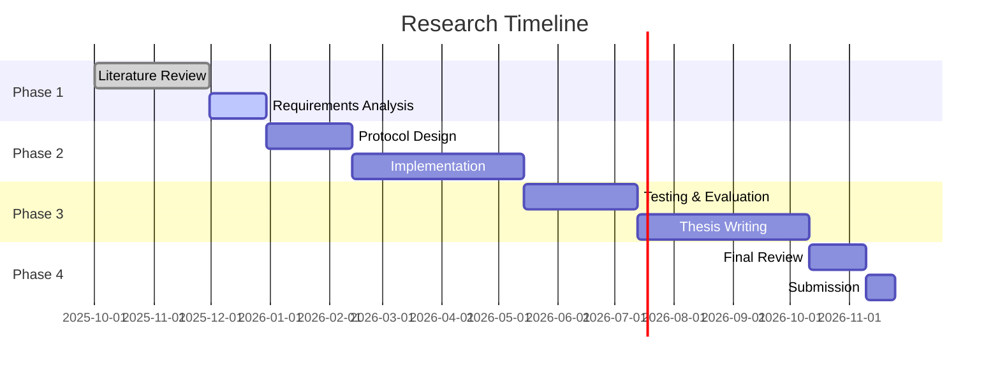

# Tangram Protocol - Decentralized Framework for Secure Medical Data Analysis: End-to-End Zero-Knowledge Proofs with Distributed Data Storage Systems

**To:**
Professor James Kang,
Professor Tri Dang,
Professor Nalin Arachchilage,

**From:**
Tristan Nguyen
PhD Candidate
tristansummer23@gmail.com

## Abstract
A research proposal for a decentralized, secure, and patient-centric medical record protocol leveraging blockchain technology and zero-knowledge proofs to revolutionize healthcare data management.

## Table of Contents
- [Tangram Protocol - Decentralized Framework for Secure Medical Data Analysis: End-to-End Zero-Knowledge Proofs with Distributed Data Storage Systems](#tangram-protocol---decentralized-framework-for-secure-medical-data-analysis-end-to-end-zero-knowledge-proofs-with-distributed-data-storage-systems)
  - [Abstract](#abstract)
  - [Table of Contents](#table-of-contents)
  - [1. Introduction and Problem Statement](#1-introduction-and-problem-statement)
  - [2. Research Objectives](#2-research-objectives)
  - [3. Literature Review and Theoretical Foundation](#3-literature-review-and-theoretical-foundation)
    - [3.1 Medical Data Sharing and Analysis Challenges](#31-medical-data-sharing-and-analysis-challenges)
    - [3.2 Distributed Ledger Technologies in Medical Data Management](#32-distributed-ledger-technologies-in-medical-data-management)
    - [3.3 Zero-Knowledge Proofs for Medical Data Privacy](#33-zero-knowledge-proofs-for-medical-data-privacy)
    - [3.4 Decentralized Storage for Medical Data](#34-decentralized-storage-for-medical-data)
  - [4. Research Questions and Objectives](#4-research-questions-and-objectives)
    - [4.1 Framework Architecture and Integration](#41-framework-architecture-and-integration)
    - [4.2 End-to-End Privacy via Zero-Knowledge Proofs](#42-end-to-end-privacy-via-zero-knowledge-proofs)
    - [4.3 Formal Verification and Security Analysis](#43-formal-verification-and-security-analysis)
  - [5. Proposed Methodology](#5-proposed-methodology)
  - [6. Expected Contributions](#6-expected-contributions)
    - [6.1 Theoretical Contributions](#61-theoretical-contributions)
    - [6.2 Practical Contributions](#62-practical-contributions)
  - [7. Expected Impact and Significance](#7-expected-impact-and-significance)
    - [7.1 Academic Impact](#71-academic-impact)
    - [7.2 Practical Impact](#72-practical-impact)
    - [7.3 Societal Impact](#73-societal-impact)
  - [8. Conclusion](#8-conclusion)
  - [9. Research Timeline](#9-research-timeline)
  - [10. References](#10-references)

## 1. Introduction and Problem Statement

This study undertakes a comprehensive systematic review of existing medical data sharing methodologies, with particular emphasis on multi-institutional clinical trial data management practices. The review critically examines current frameworks, technologies, and policies governing medical data access and analysis. It uncovers inherent limitations in privacy preservation, interoperability challenges, and computational inefficiencies. Through this analytical process, the study identifies unresolved issues and research gaps in the literature regarding secure collaborative analysis of longitudinal patient health records. This establishes a clear rationale and justification for developing the Tangram Protocol as a novel solution [20][21].

Current medical data systems suffer from fundamental architectural flaws that impede secure collaboration. Traditional Electronic Health Records (EHRs) create isolated data silos vulnerable to cyberattacks. Existing decentralized approaches fail to provide true end-to-end privacy guarantees during analysis phases. Medical data typically remains protected only in transit and at rest, but must be decrypted for analysis. This creates critical vulnerability points that compromise patient privacy.

This study develops and validates the Tangram Protocol as a transformative solution. It leverages Zero-Knowledge Proofs (ZKP) for both access control and private computation on medical data stored in decentralized storage systems. The research demonstrates how this approach enables collaborative clinical trial analysis while maintaining complete data confidentiality throughout the entire lifecycle. This addresses the fundamental gap where medical data privacy is compromised during computational analysis phases.

## 2. Research Objectives
1. Design a decentralized protocol for secure medical record management
2. Implement zero-knowledge proofs for privacy-preserving data sharing
3. Ensure interoperability with existing healthcare standards (HL7, FHIR)
4. Develop a patient-centric access control mechanism
5. Evaluate performance and security of the proposed solution

## 3. Literature Review and Theoretical Foundation
### 3.1 Medical Data Sharing and Analysis Challenges
This study will conduct a systematic examination of medical data sharing challenges across regulatory, technical, and operational dimensions. The investigation will analyze how privacy, security, and interoperability constraints under frameworks like HIPAA and GDPR create barriers to collaborative medical research [4]. Through comprehensive analysis of existing solutions, including blockchain-based frameworks for clinical data sharing [3], the research will identify critical gaps where current approaches fail to enable secure multi-institutional analysis of medical data without compromising patient privacy, thereby establishing the necessity for novel cryptographic approaches that maintain data confidentiality during computation [6][7][9][16][21].

### 3.2 Distributed Ledger Technologies in Medical Data Management
This research will comprehensively evaluate the application of Distributed Ledger Technologies (DLTs) in medical data management, examining early deployments such as MedRec for medical data access and permission management [10] and Hedera's healthcare applications [8][11], to understand scalability and privacy limitations [1][2]. The study will analyze how modern DLTs with expressive smart contract capabilities can serve as foundations for managing medical data as programmable on-chain entities with embedded access policies. This analysis will demonstrate how DLTs can provide immutable audit trails and access control for medical data while integrating with decentralized storage systems for scalable data management, thereby justifying the selection of DLT-based architecture for the Tangram Protocol.

### 3.3 Zero-Knowledge Proofs for Medical Data Privacy
This investigation will conduct an in-depth analysis of ZKP applications in healthcare, examining how cryptographic techniques like zk-SNARKs and zk-STARKs can enable verifiable computation on encrypted medical data [13]. The study will systematically review existing implementations to identify limitations in current approaches and demonstrate how ZKP circuits can execute complex statistical analyses and cohort selections on medical data without revealing underlying patient information. This analysis will establish how ZKP technology can transform medical data analysis by enabling researchers to obtain proven, correct results without accessing raw patient data, thereby providing the theoretical foundation for implementing privacy-preserving computation in the Tangram Protocol.

### 3.4 Decentralized Storage for Medical Data
This research will evaluate decentralized storage systems, including IPFS for content-addressed file systems [15], for their suitability in managing large-scale medical datasets, examining attributes such as censorship resistance, availability guarantees, and cryptographic integrity proofs. The study will analyze how decentralized storage can serve as a secure, off-chain repository for encrypted longitudinal patient health records while maintaining integration with on-chain access control mechanisms, thereby establishing the technical foundation for hybrid on-chain/off-chain medical data management in the Tangram Protocol.
## 4. Research Questions and Objectives

### 4.1 Framework Architecture and Integration

**Research Question:** This study will investigate how a platform-agnostic, DLT-native framework integrated with decentralized storage can be architected to enable scalable and secure management of medical data for multi-institution clinical trials while maintaining complete privacy throughout the analysis lifecycle.

**Objectives:**

1.1: This research will design and validate the Tangram Protocol as a generalized DLT architecture that models medical data as on-chain digital assets with embedded ZKP-based access control policies, thereby creating a reusable framework applicable across multiple blockchain platforms.

1.2: The study will develop and test a generic interface for integrating decentralized storage protocols with on-chain verification of data availability proofs, thereby enabling scalable medical data management without compromising security or auditability.

1.3: This investigation will conduct comprehensive evaluation of architectural trade-offs between on-chain provenance tracking and off-chain medical data storage to optimize for scalability, security, and regulatory compliance, thereby providing empirical evidence for optimal system design decisions.

### 4.2 End-to-End Privacy via Zero-Knowledge Proofs

**Research Question:** This research will determine how ZKP can enable an end-to-end privacy-preserving architecture for medical data that secures both granular access control and allows for verifiable, private computation on sensitive longitudinal patient health records without ever exposing the underlying data.

**Objectives:**

2.1: This study will implement and validate ZKP-based smart contracts that facilitate verifiable credential checks for medical data access while preserving researcher anonymity and institutional privacy, thereby demonstrating practical privacy-preserving access control for sensitive medical data.

2.2: The research will design, implement, and benchmark ZKP circuits for representative clinical trial queries including patient cohort selection and aggregate statistical functions that execute over encrypted medical data stored in decentralized storage, thereby proving the feasibility of complex medical data analysis without compromising patient privacy.

2.3: This investigation will conduct comprehensive mapping of Tangram's privacy mechanisms to international data protection laws including HIPAA, GDPR, and Vietnam's Decree 13/2023/ND-CP, thereby providing a regulatory compliance framework for decentralized medical data systems.

### 4.3 Formal Verification and Security Analysis

**Research Question:** This study will establish what formal verification methodologies can provide rigorous mathematical guarantees for the cryptographic and smart contract components managing medical data in the Tangram Protocol, and empirically demonstrate how its performance compares with existing medical data sharing frameworks.

**Objectives:**

3.1: This research will employ formal verification tools to mathematically prove the correctness and security of Tangram's smart contract logic and ZKP validation mechanisms for medical data access control, thereby providing mathematical assurance of system security properties.

3.2: The study will develop and validate a comprehensive formal threat model encompassing adversarial behaviors in medical data systems and formally prove Tangram's resilience against collusion, inference attacks, and ZKP setup vulnerabilities, thereby establishing robust security guarantees for sensitive medical data handling.

3.3: This investigation will conduct extensive benchmarking of Tangram's performance using HL7/FHIR-compliant synthetic medical datasets, measuring transaction latency, storage proof verification times, and ZKP generation/verification overhead for private medical data computations [14], thereby providing empirical evidence of practical viability for real-world medical data applications.

## 5. Proposed Methodology
5.1 Theoretical Foundation Development (Months 1-8)
This phase will conduct systematic review of medical data sharing frameworks and comprehensive analysis of ZKP schemes for their applicability to medical data privacy challenges. The study will develop formal models for platform-agnostic integration of DLT, ZKP, and decentralized storage systems, thereby establishing the theoretical foundation for secure medical data analysis.
5.2 Framework Design and Specification (Months 9-16)
This research will design the comprehensive system architecture integrating DLT with decentralized storage for medical data management. The study will specify cryptographic protocols for ZKP-based access control and develop ZKP circuits for clinical trial use cases with off-chain private query protocols. This phase will develop formal security models and threat analysis specific to medical data systems, thereby creating a complete specification for privacy-preserving medical data analysis.
5.3 Prototype Implementation and Validation (Months 17-26)
This investigation will implement core system components demonstrating the platform-agnostic design principles for medical data management. The study will develop and test ZKP circuits with off-chain services for generating proofs on synthetic HL7/FHIR medical datasets. Comprehensive performance analysis will measure transaction throughput, medical data access latency, and resource utilization, thereby providing empirical validation of the Tangram Protocol's practical viability.
5.4 Formal Analysis and Verification (Months 27-32)
This phase will conduct formal verification of smart contract logic and ZKP protocols for medical data systems. The research will perform comprehensive performance evaluation against established benchmarks and comparative analysis with existing medical data sharing approaches. The study will validate regulatory compliance capabilities for medical data protection, thereby providing rigorous mathematical and empirical proof of system superiority.
5.5 Evaluation and Dissemination (Months 33-36)
This final phase will conduct comprehensive evaluation of research contributions to medical data security and privacy. The study will prepare thesis documentation and academic publications while developing open-source research artifacts, thereby ensuring broad dissemination and practical application of research outcomes.

## 6. Expected Contributions
### 6.1 Theoretical Contributions
**Novel Platform-Agnostic Medical Data Framework:** This research develops new theoretical models for integrating DLT with decentralized storage. These models are specifically optimized for private medical data analysis in clinical trials. The framework is applicable across various blockchain platforms. It provides a foundational architecture for next-generation medical data systems.
**Privacy-Preserving Medical Data Computation Protocol:** The study creates a novel cryptographic protocol. It combines attribute-based access control with ZKP-based private computation for medical data. This enables statistical analysis on data that remains encrypted throughout the process. It solves the fundamental problem of medical data privacy during analysis phases.
**Formal Verification Methodology for Medical Data Systems:** This investigation develops comprehensive formal methods for verifying security and privacy properties. These methods apply to hybrid distributed systems handling sensitive medical data. They establish rigorous security assurance methodologies for healthcare applications.
### 6.2 Practical Contributions
**Clinical Trial Analytics Without Data Exposure:** This research demonstrates practical implementation of multi-institution clinical trial analysis. Medical data remains confidential throughout collaborative research processes. This addresses a major bottleneck preventing medical research collaboration.
**Regulatory Compliance Framework for Decentralized Medical Data:** The study develops systematic approaches ensuring compliance with medical data protection regulations. These approaches apply to decentralized systems supporting computation. They enable practical deployment of privacy-preserving medical data systems.
**Performance-Optimized Medical Data Analysis:** This investigation identifies and implements optimization techniques. These techniques are specific to distributed medical data analysis systems using ZKP and decentralized storage. They provide practical guidance for scalable medical data applications.

## 7. Expected Impact and Significance

### 7.1 Academic Impact
This research contributes novel theoretical frameworks to distributed systems, applied cryptography, and health informatics [12][17][18][19]. Methodologies for integrating ZKP for end-to-end medical data privacy provide foundations for future privacy-sensitive domain research. This advances the academic understanding of secure medical data systems.

### 7.2 Practical Impact
The Tangram Protocol addresses critical real-world challenges in medical data sharing. It enables vital research and analysis currently stalled by privacy concerns. Outcomes inform development of new technical standards and policies for secure medical data exchange and collaborative research. This transforms how medical institutions collaborate on sensitive data analysis.

### 7.3 Societal Impact
By enabling more secure and efficient medical data analysis, this research contributes to faster medical discoveries, improved healthcare outcomes, reduced research costs, and enhanced patient autonomy in medical data management decisions. This directly benefits public health and advances medical science.
## 8. Conclusion

This proposed research addresses fundamental challenges in medical data sharing and analysis through novel integration of end-to-end ZKP within a platform-agnostic, decentralized architecture using advanced decentralized storage systems. By enabling verifiable private computation on medical data that never requires decryption, this work will make significant theoretical and practical contributions to distributed systems, applied cryptography, and health informatics. The comprehensive approach will produce research outcomes with both academic significance and real-world applicability, thereby paving the way for a new generation of secure, privacy-preserving medical data analysis platforms that can transform collaborative healthcare research while maintaining absolute patient privacy.
## 9. Research Timeline

## 10. References

[1] S. Nakamoto, "Bitcoin: A Peer-to-Peer Electronic Cash System," 2008.

[2] M. Mettler, "Blockchain Technology in Healthcare: The Revolution Starts Here," 2016.

[3] P. Zhang et al., "FHIRChain: Applying Blockchain to Securely and Scalably Share Clinical Data," 2018.

[4] World Health Organization, "Global diffusion of eHealth: Making universal health coverage achievable," 2016.

[6] A. M. Tawfik, A. Al-Ahwal, A. S. T. Eldien et al., "ACHealthChain blockchain framework for access control and privacy preservation in healthcare," Sci. Rep., vol. 15, p. 16696, 2025. doi: [10.1038/s41598-025-00757-1](https://doi.org/10.1038/s41598-025-00757-1).

[7] A. A. Monie, D. K. P. V. V. Rajeswari, and K. S. B. Prasad, "Blockchain technology for securing and managing electronic health records (EHRs)," Int. J. Med. Eng. Inform., vol. 15, no. 5, pp. 536–550, 2023. doi: [10.1504/IJMEI.2023.133742](https://doi.org/10.1504/IJMEI.2023.133742).

[8] Hedera, "Healthcare," Hedera, 2024. [Online](https://hedera.com/healthcare).

[9] S. K. H. Islam, M. A. Baig, M. M. Khan, and M. A. Khan, "A Blockchain-Based Framework for Secure and Privacy-Preserving Electronic Health Record Sharing," IEEE Access, vol. 11, pp. 11467–11482, 2023. doi: [10.1109/ACCESS.2023.3241280](https://doi.org/10.1109/ACCESS.2023.3241280).

[10] A. Azaria, A. Ekblaw, T. Vieira, and A. Lippman, "MedRec: Using Blockchain for Medical Data Access and Permission Management," in Proc. 2016 2nd Int. Conf. Open Big Data (OBD), Vienna, Austria, Aug. 2016, pp. 25–30. doi: [10.1109/OBD.2016.11](https://doi.org/10.1109/OBD.2016.11).

[11] Hedera, "Smart Contracts in Healthcare," Hedera, 2024. [Online](https://hedera.com/learning/smart-contracts/smart-contracts-healthcare).

[12] A. Dwivedi, G. Srivastava, S. Dhar, and R. Singh, "A decentralized privacy-preserving healthcare blockchain for IoT," Sensors, vol. 19, no. 2, p. 326, 2019. doi: [10.3390/s19020326](https://doi.org/10.3390/s19020326).

[13] S. Goldwasser, S. Micali, and C. Rackoff, "The Knowledge Complexity of Interactive Proof Systems," SIAM J. Comput., vol. 18, no. 1, pp. 186–208, 1989. doi: [10.1137/0218012](https://doi.org/10.1137/0218012).

[14] D. Ben-Sasson, I. Bentov, Y. Horesh, and M. Riabzev, "Scalable, transparent, and post-quantum secure computational integrity," IACR Cryptol. ePrint Arch., vol. 2018, p. 46, 2018. [Online](https://eprint.iacr.org/2018/046).

[15] J. Benet, "IPFS - Content Addressed, Versioned, P2P File System," arXiv:1407.3561 [cs], 2014. [Online](http://arxiv.org/abs/1407.3561).

[16] J. Andrew, D. P. Isravel, K. M. Sagayam, B. Bhushan, Y. Sei, and J. Eunice, "Blockchain for healthcare systems: Architecture, security challenges, trends and future directions," J. Netw. Comput. Appl., vol. 215, p. 103633, 2023. doi: [10.1016/j.jnca.2023.103633](https://doi.org/10.1016/j.jnca.2023.103633).

[17] F. O. Catak, C. Rong, Ø. Meinich-Bache, S. Brunner, and K. Engan, "Graphical Abstract Building Trust in Healthcare with Privacy Techniques: Blockchain in the Cloud," arXiv:2504.20700, 2025. [Online](https://arxiv.org/pdf/2504.20700.pdf).

[18] D. C. Nguyen, P. N. Pathirana, M. Ding, and A. Seneviratne, "BEdgeHealth: A Decentralized Architecture for Edge-based IoMT Networks Using Blockchain," IEEE Internet Things J., 2021. [Online](https://arxiv.org/pdf/2109.14295.pdf).

[19] I. Kotsiuba et al., "Decentralized e-Health Architecture for Boosting Healthcare Analytics," Bitfury, 2019. [Online](https://bitfury.com/content/downloads/research-decentralized-e-health-architecture.pdf).

[20] "A Survey on Blockchain in Healthcare," arXiv:1901.10645, 2019. [Online](https://arxiv.org/pdf/1901.10645.pdf).

[21] "Blockchain technology in healthcare: A systematic review," PMC, 2024. [Online](https://pmc.ncbi.nlm.nih.gov/articles/PMC11461297/).

---
*Last updated: August 31, 2025*
