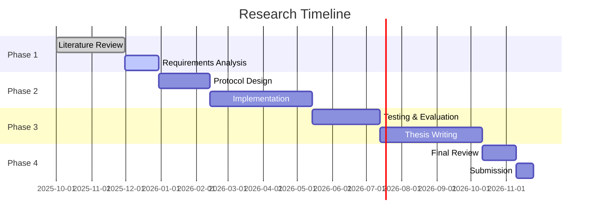

# Tangram Protocol - Decentralized Framework for Secure Medical Data Analysis: End-to-End Zero-Knowledge Proofs with Distributed Data Storage Systems

**To:**
Professor James Kang,
Professor Tri Dang,
Professor Nalin Arachchilage,

**From:**
Tristan Nguyen
PhD Candidate
tristansummer23@gmail.com

## Abstract
A research proposal for a decentralized, secure, and patient-centric medical record protocol leveraging blockchain technology and zero-knowledge proofs to revolutionize healthcare data management.

## Table of Contents
- [Introduction](#introduction)
- [Research Objectives](#research-objectives)
- [Literature Review](#literature-review)
- [Methodology](#methodology)
- [Expected Contributions](#expected-contributions)
- [Research Timeline](#research-timeline)
- [References](#references)

## Introduction and Problem Statement

This study will undertake a comprehensive systematic review of existing medical data sharing methodologies, with particular emphasis on multi-institutional clinical trial data management practices. The review will critically examine current frameworks, technologies, and policies governing medical data access and analysis to uncover inherent limitations in privacy preservation, interoperability challenges, and computational inefficiencies. Through this analytical process, the study aims to identify unresolved issues and research gaps within the literature regarding secure collaborative analysis of longitudinal patient health records, thereby establishing a clear rationale and justification for developing the Tangram Protocol as a novel solution.

Current medical data systems suffer from fundamental architectural flaws that impede secure collaboration. This research will systematically analyze how traditional Electronic Health Records (EHRs) create isolated data silos vulnerable to cyberattacks, while existing decentralized approaches fail to provide true end-to-end privacy guarantees during analysis phases. The investigation will reveal how medical data typically remains protected only in transit and at rest, but must be decrypted for analysis, creating critical vulnerability points that compromise patient privacy.

This study will develop and validate the Tangram Protocol as a transformative solution that leverages Zero-Knowledge Proofs (ZKP) for both access control and private computation on medical data stored in decentralized storage systems. The research will demonstrate how this approach enables collaborative clinical trial analysis while maintaining complete data confidentiality throughout the entire lifecycle, addressing the fundamental gap where medical data privacy is compromised during computational analysis phases.

## Research Objectives
1. Design a decentralized protocol for secure medical record management
2. Implement zero-knowledge proofs for privacy-preserving data sharing
3. Ensure interoperability with existing healthcare standards (HL7, FHIR)
4. Develop a patient-centric access control mechanism
5. Evaluate performance and security of the proposed solution

## Literature Review and Theoretical Foundation
### 2.1 Medical Data Sharing and Analysis Challenges
This study will conduct a systematic examination of medical data sharing challenges across regulatory, technical, and operational dimensions. The investigation will analyze how privacy, security, and interoperability constraints under frameworks like HIPAA and GDPR create barriers to collaborative medical research. Through comprehensive analysis of existing solutions, the research will identify critical gaps where current approaches fail to enable secure multi-institutional analysis of medical data without compromising patient privacy, thereby establishing the necessity for novel cryptographic approaches that maintain data confidentiality during computation.

### 2.2 Distributed Ledger Technologies in Medical Data Management
This research will comprehensively evaluate the application of Distributed Ledger Technologies (DLTs) in medical data management, examining early deployments to understand scalability and privacy limitations. The study will analyze how modern DLTs with expressive smart contract capabilities can serve as foundations for managing medical data as programmable on-chain entities with embedded access policies. This analysis will demonstrate how DLTs can provide immutable audit trails and access control for medical data while integrating with decentralized storage systems for scalable data management, thereby justifying the selection of DLT-based architecture for the Tangram Protocol.

### 2.3 Zero-Knowledge Proofs for Medical Data Privacy
This investigation will conduct an in-depth analysis of ZKP applications in healthcare, examining how cryptographic techniques like zk-SNARKs and zk-STARKs can enable verifiable computation on encrypted medical data. The study will systematically review existing implementations to identify limitations in current approaches and demonstrate how ZKP circuits can execute complex statistical analyses and cohort selections on medical data without revealing underlying patient information. This analysis will establish how ZKP technology can transform medical data analysis by enabling researchers to obtain proven, correct results without accessing raw patient data, thereby providing the theoretical foundation for implementing privacy-preserving computation in the Tangram Protocol.

### 2.4 Decentralized Storage for Medical Data
This research will evaluate decentralized storage systems for their suitability in managing large-scale medical datasets, examining attributes such as censorship resistance, availability guarantees, and cryptographic integrity proofs. The study will analyze how decentralized storage can serve as a secure, off-chain repository for encrypted longitudinal patient health records while maintaining integration with on-chain access control mechanisms, thereby establishing the technical foundation for hybrid on-chain/off-chain medical data management in the Tangram Protocol.

## Methodology
### System Architecture
- Network topology
- Data storage model
- Consensus mechanism
- Smart contract design

### Technical Components
1. **Identity Management**
   - Decentralized identifiers (DIDs)
   - Verifiable credentials

2. **Data Model**
   - Standardized medical data representation
   - On-chain vs. off-chain storage

3. **Privacy Mechanisms**
   - Zero-knowledge proofs
   - Selective disclosure
   - Data minimization techniques

4. **Access Control**
   - Attribute-based access control
   - Patient consent management
   - Emergency access protocols

### Implementation Plan
- Technology stack selection
- Development phases
- Testing and validation

## Expected Contributions
1. Novel protocol for decentralized medical records
2. Enhanced privacy-preserving techniques
3. Improved patient data ownership and control
4. Interoperability framework for healthcare data
5. Performance and security evaluation metrics

## Research Timeline

## References

[1] S. Nakamoto, "Bitcoin: A Peer-to-Peer Electronic Cash System," 2008.

[2] A. Azaria et al., "MedRec: Using Blockchain for Medical Data Access and Permission Management," 2016.

[3] M. Mettler, "Blockchain Technology in Healthcare: The Revolution Starts Here," 2016.

[4] P. Zhang et al., "FHIRChain: Applying Blockchain to Securely and Scalably Share Clinical Data," 2018.

[5] World Health Organization, "Global diffusion of eHealth: Making universal health coverage achievable," 2016.

[6] A. M. Tawfik, A. Al-Ahwal, A. S. T. Eldien et al., "ACHealthChain blockchain framework for access control and privacy preservation in healthcare," Sci. Rep., vol. 15, p. 16696, 2025. doi: 10.1038/s41598-025-00757-1.

[7] A. A. Monie, D. K. P. V. V. Rajeswari, and K. S. B. Prasad, "Blockchain technology for securing and managing electronic health records (EHRs)," Int. J. Med. Eng. Inform., vol. 15, no. 5, pp. 536–550, 2023. doi: 10.1504/IJMEI.2023.133742.

[8] Hedera, "Healthcare," Hedera, 2024. [Online]. Available: https://hedera.com/healthcare.

[9] S. K. H. Islam, M. A. Baig, M. M. Khan, and M. A. Khan, "A Blockchain-Based Framework for Secure and Privacy-Preserving Electronic Health Record Sharing," IEEE Access, vol. 11, pp. 11467–11482, 2023. doi: 10.1109/ACCESS.2023.3241280.

[10] A. Azaria, A. Ekblaw, T. Vieira, and A. Lippman, "MedRec: Using Blockchain for Medical Data Access and Permission Management," in Proc. 2016 2nd Int. Conf. Open Big Data (OBD), Vienna, Austria, Aug. 2016, pp. 25–30. doi: 10.1109/OBD.2016.11.

[11] Hedera, "Smart Contracts in Healthcare," Hedera, 2024. [Online]. Available: https://hedera.com/learning/smart-contracts/smart-contracts-healthcare.

[12] A. Dwivedi, G. Srivastava, S. Dhar, and R. Singh, "A decentralized privacy-preserving healthcare blockchain for IoT," Sensors, vol. 19, no. 2, p. 326, 2019. doi: 10.3390/s19020326.

[13] S. Goldwasser, S. Micali, and C. Rackoff, "The Knowledge Complexity of Interactive Proof Systems," SIAM J. Comput., vol. 18, no. 1, pp. 186–208, 1989. doi: 10.1137/0218012.

[14] D. Ben-Sasson, I. Bentov, Y. Horesh, and M. Riabzev, "Scalable, transparent, and post-quantum secure computational integrity," IACR Cryptol. ePrint Arch., vol. 2018, p. 46, 2018. [Online]. Available: https://eprint.iacr.org/2018/046.

[15] J. Benet, "IPFS - Content Addressed, Versioned, P2P File System," arXiv:1407.3561 [cs], 2014. [Online]. Available: http://arxiv.org/abs/1407.3561.

[16] J. Andrew, D. P. Isravel, K. M. Sagayam, B. Bhushan, Y. Sei, and J. Eunice, "Blockchain for healthcare systems: Architecture, security challenges, trends and future directions," J. Netw. Comput. Appl., vol. 215, p. 103633, 2023. doi: 10.1016/j.jnca.2023.103633.

[17] F. O. Catak, C. Rong, Ø. Meinich-Bache, S. Brunner, and K. Engan, "Graphical Abstract Building Trust in Healthcare with Privacy Techniques: Blockchain in the Cloud," arXiv:2504.20700, 2025. [Online]. Available: https://arxiv.org/pdf/2504.20700.pdf.

[18] D. C. Nguyen, P. N. Pathirana, M. Ding, and A. Seneviratne, "BEdgeHealth: A Decentralized Architecture for Edge-based IoMT Networks Using Blockchain," IEEE Internet Things J., 2021. [Online]. Available: https://arxiv.org/pdf/2109.14295.pdf.

[19] I. Kotsiuba et al., "Decentralized e-Health Architecture for Boosting Healthcare Analytics," Bitfury, 2019. [Online]. Available: https://bitfury.com/content/downloads/research-decentralized-e-health-architecture.pdf.

[20] A. M. Tawfik et al., "ACHealthChain blockchain framework for access control and privacy preservation in healthcare," Sci. Rep., vol. 15, p. 16696, 2025. doi: 10.1038/s41598-025-00757-1. (Duplicate of [6])

[21] "A Survey on Blockchain in Healthcare," arXiv:1901.10645, 2019. [Online]. Available: https://arxiv.org/pdf/1901.10645.pdf.

[22] "Blockchain technology in healthcare: A systematic review," PMC, 2024. [Online]. Available: https://pmc.ncbi.nlm.nih.gov/articles/PMC11461297/.

---
*Last updated: August 31, 2025*
