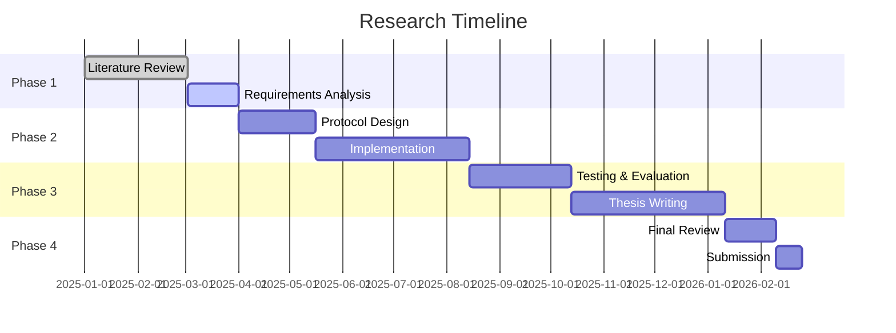

# Tangram Protocol: Decentralized Medical Record System

## Abstract
A research proposal for a decentralized, secure, and patient-centric medical record protocol leveraging blockchain technology and zero-knowledge proofs to revolutionize healthcare data management.

## Table of Contents
- [Introduction](#introduction)
- [Research Objectives](#research-objectives)
- [Literature Review](#literature-review)
- [Methodology](#methodology)
- [Expected Contributions](#expected-contributions)
- [Research Timeline](#research-timeline)
- [References](#references)

## Introduction
### Background
- Current challenges in medical record management
- Centralized vs. decentralized approaches
- The need for patient data sovereignty

### Problem Statement
- Data silos in healthcare
- Privacy and security concerns
- Interoperability issues
- Patient access and control limitations

## Research Objectives
1. Design a decentralized protocol for secure medical record management
2. Implement zero-knowledge proofs for privacy-preserving data sharing
3. Ensure interoperability with existing healthcare standards (HL7, FHIR)
4. Develop a patient-centric access control mechanism
5. Evaluate performance and security of the proposed solution

## Literature Review
### Blockchain in Healthcare
- Current blockchain-based medical record systems
- Smart contracts for healthcare data management
- Privacy-preserving techniques in healthcare

### Related Work
- MedRec
- FHIR Chain
- Other decentralized healthcare solutions
- Regulatory compliance (HIPAA, GDPR)

## Methodology
### System Architecture
- Network topology
- Data storage model
- Consensus mechanism
- Smart contract design

### Technical Components
1. **Identity Management**
   - Decentralized identifiers (DIDs)
   - Verifiable credentials

2. **Data Model**
   - Standardized medical data representation
   - On-chain vs. off-chain storage

3. **Privacy Mechanisms**
   - Zero-knowledge proofs
   - Selective disclosure
   - Data minimization techniques

4. **Access Control**
   - Attribute-based access control
   - Patient consent management
   - Emergency access protocols

### Implementation Plan
- Technology stack selection
- Development phases
- Testing and validation

## Expected Contributions
1. Novel protocol for decentralized medical records
2. Enhanced privacy-preserving techniques
3. Improved patient data ownership and control
4. Interoperability framework for healthcare data
5. Performance and security evaluation metrics

## Research Timeline

## References
1. Nakamoto, S. (2008). Bitcoin: A Peer-to-Peer Electronic Cash System.
2. Azaria, A., et al. (2016). MedRec: Using Blockchain for Medical Data Access and Permission Management.
3. Mettler, M. (2016). Blockchain Technology in Healthcare: The Revolution Starts Here.
4. Zhang, P., et al. (2018). FHIRChain: Applying Blockchain to Securely and Scalably Share Clinical Data.
5. World Health Organization. (2016). Global diffusion of eHealth: Making universal health coverage achievable.

---
*Last updated: August 31, 2025*
